# Задание по основам и продвинутому использованию Docker

В этом задании вы будете работать с концепциями и инструментами Docker, которым вас научит Shubham Bhaiya. Задание охватывает следующие темы:

- **Введение и цель:** Понимание роли Docker в современной разработке.
- **Виртуализация против контейнеризации:** Изучение различий и преимуществ.
- **Что такое сборка:** Понимание процесса сборки Docker.
- **Терминология Docker:** Ознакомление с ключевыми терминами Docker.
- **Компоненты Docker:** Изучение Docker Engine, образов, контейнеров и многого другого.
- **Создание проекта с использованием Docker:** Контейнеризация примера проекта.
- **Многоэтапная сборка Docker / Образы без дистрибутива:** Оптимизация образов.
- **Docker Hub (Push/Tag/Pull):** Управление и распространение образов Docker.
- **Тома Docker:** Сохранение данных между запусками контейнеров.
- **Сетевое взаимодействие Docker:** Подключение контейнеров с помощью сетей.
- **Docker Compose:** Оркестрация многоконтейнерных приложений.
- **Docker Scout:** Анализируйте ваши образы на наличие уязвимостей и полезной информации.

Выполните все приведенные ниже задания и задокументируйте свои действия, команды и наблюдения в файле с именем `solution.md`.

---

## Challenge Tasks

### Задача 1: Введение и концептуальное понимание
1. **Написать введение:**  
   - В файле `solution.md` кратко объясните назначение Docker в современном DevOps.
   - Сравните **виртуализацию и контейнеризацию** и объясните, почему контейнеризация является предпочтительным подходом для микросервисов и конвейеров CI/CD.

---

### Задача 2: Создайте Dockerfile для тестового проекта.
1. **Выберите или создайте пример приложения.:**  
   - Выберите простое приложение (например, базовое приложение на Node.js, Python или Java, которое выводит «Hello, Docker!» или отображает простую веб-страницу).

   app.py:

   ```
   from flask import Flask

   app = Flask(__name__)

   @app.route('/')
   def hello_world():
   return 'Hello World!'

   if __name__ == '__main__':
      app.run(host='0.0.0.0', port=8080)
   
   ```

2. **Напишите Dockerfile:**  
   - Создайте файл Dockerfile, определяющий способ сборки образа для вашего приложения.

   Dockerfile:

   ```
   FROM python:3.11.14-alpine3.23

   RUN pip install flask

   COPY app.py .

   CMD ["python3", "flask.py"]
   ```
   
   - Добавьте в свой Dockerfile комментарии, поясняющие каждую инструкцию.
      FROM - базовый образ
      RUN - устанавливаем flask библиотеку
      COPY - копируем файл с кодом
      CMD - запускаем 

   - Создайте свой образ, используя:
     ```bash
     docker build -t <your-username>/sample-app:latest .
     ```

   

3. **Проверьте свою сборку:**  
   - Запустите контейнер локально, чтобы убедиться, что он работает должным образом:
     ```bash
     docker run -d -p 8080:80 <your-username>/sample-app:latest
     ```
   - Убедитесь, что контейнер запущен, с помощью:
     ```bash
     docker ps
     ```
   - Проверьте логи с помощью:
     ```bash
     docker logs <container_id>
     ```

   

---

### Задача 3: Изучите терминологию и компоненты Docker.
1. **Ключевые термины документа:**  
   - В файле `solution.md` перечислите и кратко опишите ключевые термины Docker, такие как образ, контейнер, Dockerfile, том и сеть.
   - Объясните основные компоненты Docker (Docker Engine, Docker Hub и т. д.) и как они взаимодействуют.

---

### Задача 4: Оптимизируйте свой образ Docker с помощью многоэтапной сборки.
1. **Реализуйте многоэтапную сборку Docker.:**  
   - Измените существующий файл `Dockerfile`, чтобы включить многоэтапную сборку. 
   - Цель состоит в том, чтобы получить лёгкое, **без лишних элементов** (или минималистичное) итоговое изображение.

   ```
   FROM python:3.11.14-alpine3.23 AS base

   WORKDIR /app

   FROM base AS installer 

   RUN pip install flask

   FROM installer AS app

   COPY app.py .

   CMD ["python3", "/app/app.py"]
   ```
2. **Сравните размеры изображений:**  
   - Создайте образ до и после многоэтапной модификации сборки и сравните их размеры, используя:
     ```bash
     docker images
     ```
3. **Задокументируйте различия:**  
   - В файле `solution.md` объясните преимущества многоэтапной сборки и ее влияние на размер образа.

---

### Задача 5: Управляйте своими образами с помощью Docker Hub.
1. **Затегируйте свой образ:**  
   - Добавьте к изображению соответствующие теги.:
     ```bash
     docker tag <your-username>/sample-app:latest <your-username>/sample-app:v1.0
     ```

     

2. **Загрузите свой образ в Docker Hub.:**  
   - При необходимости войдите в Docker Hub.:
     ```bash
     docker login
     ```

      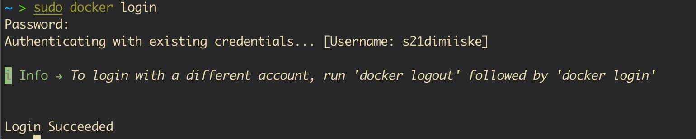

   - Запушьте образ:
     ```bash
     docker push <your-username>/sample-app:v1.0
     ```

     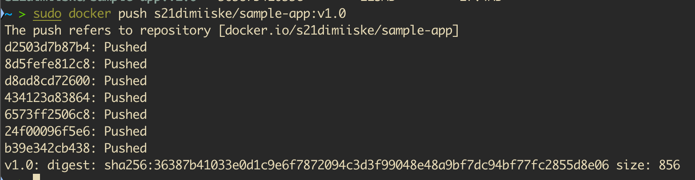

3. **(Optional) Скачайте образ:**  
   - Verify by pulling your image:
     ```bash
     docker pull <your-username>/sample-app:v1.0
     ```

      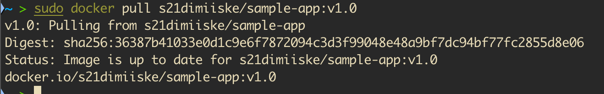

---

### Задача 6: Сохранение данных с помощью томов Docker
1. **Создайте том Docker.:**  
   - Создайте том Docker.:
     ```bash
     docker volume create my_volume
     ```

   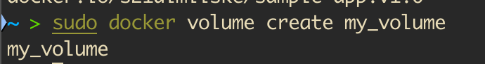

2. **Запустите контейнер с использованием тома.:**  
   - Запустите контейнер, используя том для сохранения данных.:
     ```bash
     docker run -d -v my_volume:/app/data <your-username>/sample-app:v1.0
     ```

   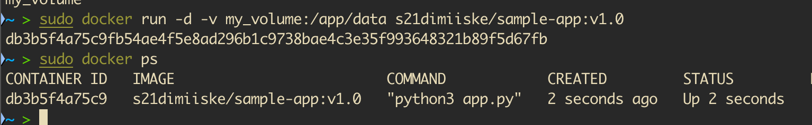

3. **Документируйте процесс:**  
   - В файле `solution.md` объясните, как тома Docker помогают обеспечить сохранение данных и почему они полезны.

---

### Задача 7: Настройка сети Docker
1. **Создание собственной сети Docker:**  
   - Создание собственной сети Docker:
     ```bash
     docker network create my_network
     ```

2. **Запуск контейнеров в одной сети.:**  
   - Запустите два контейнера (например, ваше тестовое приложение и простую базу данных, такую ​​как MySQL) в одной сети, чтобы продемонстрировать взаимодействие между контейнерами:
     ```bash
     docker run -d --name sample-app --network my_network <your-username>/sample-app:v1.0
     docker run -d --name my-db --network my_network -e MYSQL_ROOT_PASSWORD=root mysql:latest
     ```

   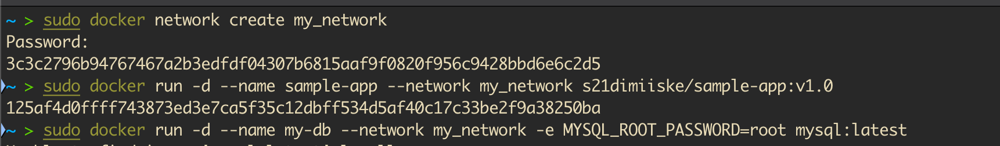

   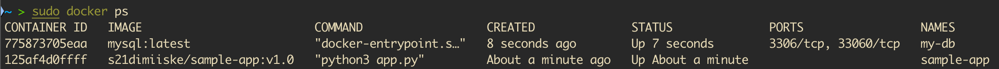

   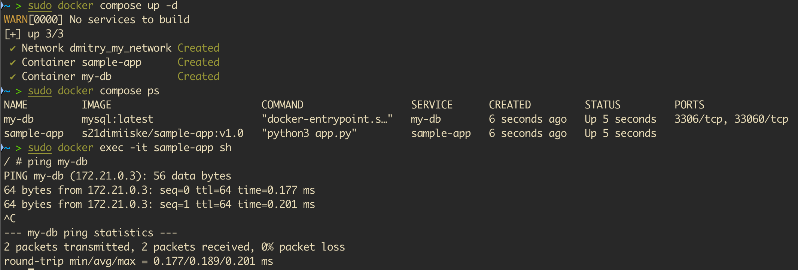

3. **Документируйте процесс:**  
   - В файле `solution.md` опишите, как сетевые возможности Docker обеспечивают взаимодействие между контейнерами и каково их значение в многоконтейнерных приложениях.

---

### Задача 8: Организуйте работу с помощью Docker Compose.
1. **Создайте docker-compose.yml File:**  
   - Создайте файл `docker-compose.yml`, в котором определены как минимум две службы (например, ваше тестовое приложение и база данных).
   - Включите определения для услуг, сетей и вольюмов.
2. **Разверните ваше приложение:**  
   - Запустите приложение, используя:
     ```bash
     docker-compose up -d
     ```

   


   - Проверьте работу системы, затем выключите её с помощью:
     ```bash
     docker-compose down
     ```

   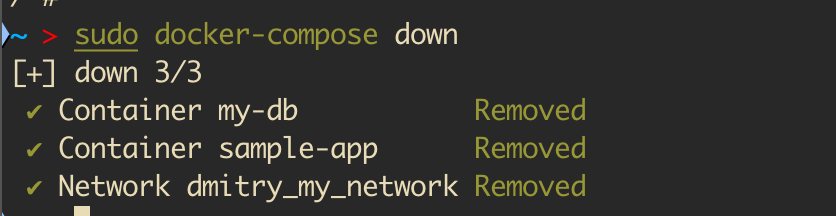


3. **Документируйте процесс:**  
   - Подробно опишите каждую службу и конфигурацию в вашем файле `solution.md`.

---

### Задача 9: Проанализируйте свой образ с помощью Docker Scout.
1. **Запуск анализа Docker Scout:**  
   - Запустите Docker Scout для вашего образа, чтобы сгенерировать подробный отчет об уязвимостях и получить ценную информацию:
     ```bash
     docker scout cves <your-username>/sample-app:v1.0
     ```

     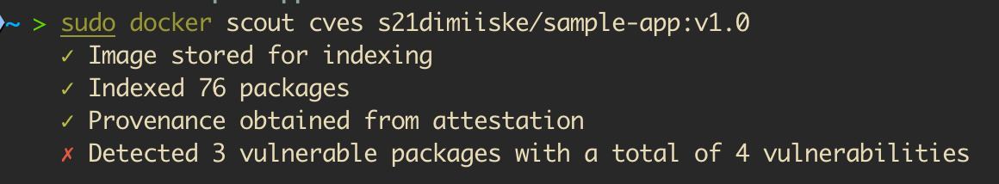
     
   - В качестве альтернативы, если это возможно, выполните следующую команду:
     ```bash
     docker scout quickview <your-username>/sample-app:v1.0
     ```
     чтобы получить общее представление о состоянии безопасности изображения.

     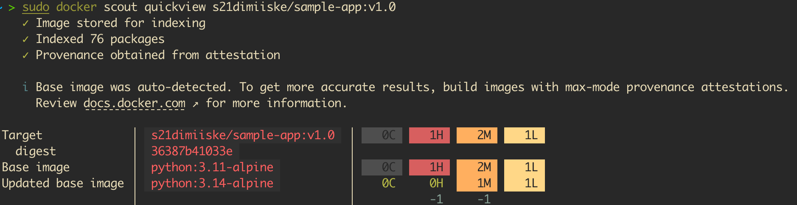

   - **Опционально:** Сохраните результат в файл для дальнейшего анализа:
     ```bash
     docker scout cves <your-username>/sample-app:v1.0 > scout_report.txt
     ```

2. **Проанализируйте и проанализируйте отчет:**  
   - Внимательно изучите результаты и сосредоточьтесь на:
     - **Список уязвимостей CVE:** Выявите уязвимости и определите их степень серьезности (например, критическая, высокая, средняя, ​​низкая).
     - **Затронутые слои/зависимости:** Определите, какие слои или зависимости образа являются причиной уязвимостей.
     - **Предложенные меры по устранению проблем:** Обратите внимание на любые рекомендуемые исправления или стратегии смягчения последствий, предоставленные Docker Scout.
   - **Шаг сравнения:** По возможности сравните этот отчет с предыдущими сборками, чтобы оценить улучшения или ухудшения в уровне безопасности вашего образа.
   - Если Docker Scout недоступен в вашей среде, задокументируйте этот факт и рассмотрите возможность использования альтернативного сканера уязвимостей (например, Trivy, Clair) для сравнительного анализа.

3. **Задокументируйте свои выводы:**  
   - В файле `solution.md` предоставьте подробное описание проведенного анализа:
     - Перечислите выявленные уязвимости и уровни их серьезности.
     - Укажите, какие слои или зависимости способствовали возникновению этих уязвимостей.
     - Изложите все практические рекомендации или шаги по устранению проблемы.
     - Подумайте, как эти выводы могут повлиять на оптимизацию ваших изображений или на вашу общую стратегию безопасности.
   - **Дополнительно:** В качестве подтверждения вашего анализа приложите скриншоты или сохраненный файл отчета (`scout_report.txt`).

---

### Задача 10: Документирование и критическое осмысление
1. **Обновите `solution.md`:**  
   - Перечислите все выполненные вами команды и шаги.
   - Предоставьте пояснения к каждой задаче и подробно опишите любые внесенные улучшения (например, оптимизация изображений с помощью многоэтапной сборки).
2. **Поразмышляйте о влиянии Docker:**  
   - Напишите краткое размышление о важности Docker в современной разработке программного обеспечения, обсудив его преимущества и потенциальные проблемы.
---

## Дополнительные ресурсы

- **[Docker Documentation](https://docs.docker.com/)**  
- **[Docker Hub](https://docs.docker.com/docker-hub/)**  
- **[Multi-stage Builds](https://docs.docker.com/develop/develop-images/multistage-build/)**  
- **[Docker Compose](https://docs.docker.com/compose/)**  
- **[Docker Scan (Vulnerability Scanning)](https://docs.docker.com/engine/scan/)**  
- **[Containerization vs. Virtualization](https://www.docker.com/resources/what-container)**
