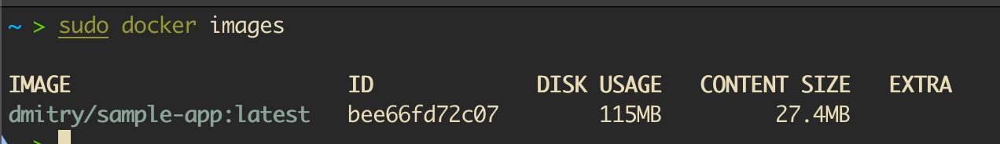
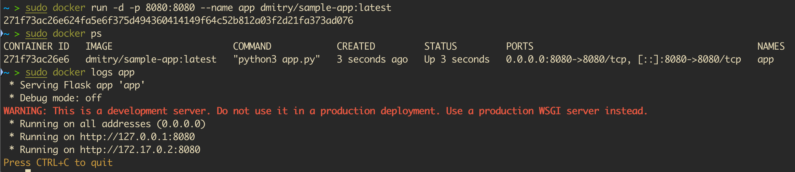

# Задание по основам и продвинутому использованию Docker

В этом задании вы будете работать с концепциями и инструментами Docker, которым вас научит Shubham Bhaiya. Задание охватывает следующие темы:

- **Введение и цель:** Понимание роли Docker в современной разработке.
- **Виртуализация против контейнеризации:** Изучение различий и преимуществ.
- **Что такое сборка:** Понимание процесса сборки Docker.
- **Терминология Docker:** Ознакомление с ключевыми терминами Docker.
- **Компоненты Docker:** Изучение Docker Engine, образов, контейнеров и многого другого.
- **Создание проекта с использованием Docker:** Контейнеризация примера проекта.
- **Многоэтапная сборка Docker / Образы без дистрибутива:** Оптимизация образов.
- **Docker Hub (Push/Tag/Pull):** Управление и распространение образов Docker.
- **Тома Docker:** Сохранение данных между запусками контейнеров.
- **Сетевое взаимодействие Docker:** Подключение контейнеров с помощью сетей.
- **Docker Compose:** Оркестрация многоконтейнерных приложений.
- **Docker Scout:** Анализируйте ваши образы на наличие уязвимостей и полезной информации.

Выполните все приведенные ниже задания и задокументируйте свои действия, команды и наблюдения в файле с именем `solution.md`.

---

## Challenge Tasks

### Задача 1: Введение и концептуальное понимание
1. **Написать введение:**  
   - В файле `solution.md` кратко объясните назначение Docker в современном DevOps.
   - Сравните **виртуализацию и контейнеризацию** и объясните, почему контейнеризация является предпочтительным подходом для микросервисов и конвейеров CI/CD.

---

### Задача 2: Создайте Dockerfile для тестового проекта.
1. **Выберите или создайте пример приложения.:**  
   - Выберите простое приложение (например, базовое приложение на Node.js, Python или Java, которое выводит «Hello, Docker!» или отображает простую веб-страницу).

   app.py:

   ```
   from flask import Flask

   app = Flask(__name__)

   @app.route('/')
   def hello_world():
   return 'Hello World!'

   if __name__ == '__main__':
      app.run(host='0.0.0.0', port=8080)
   
   ```

2. **Напишите Dockerfile:**  
   - Создайте файл Dockerfile, определяющий способ сборки образа для вашего приложения.

   Dockerfile:

   ```
   FROM python:3.11.14-alpine3.23

   RUN pip install flask

   COPY app.py .

   CMD ["python3", "flask.py"]
   ```
   
   - Добавьте в свой Dockerfile комментарии, поясняющие каждую инструкцию.
      FROM - базовый образ
      RUN - устанавливаем flask библиотеку
      COPY - копируем файл с кодом
      CMD - запускаем 

   - Создайте свой образ, используя:
     ```bash
     docker build -t <your-username>/sample-app:latest .
     ```

   

3. **Проверьте свою сборку:**  
   - Запустите контейнер локально, чтобы убедиться, что он работает должным образом:
     ```bash
     docker run -d -p 8080:80 <your-username>/sample-app:latest
     ```
   - Убедитесь, что контейнер запущен, с помощью:
     ```bash
     docker ps
     ```
   - Проверьте логи с помощью:
     ```bash
     docker logs <container_id>
     ```

   

---

### Task 3: Explore Docker Terminologies and Components
1. **Document Key Terminologies:**  
   - In your `solution.md`, list and briefly describe key Docker terms such as image, container, Dockerfile, volume, and network.
   - Explain the main Docker components (Docker Engine, Docker Hub, etc.) and how they interact.

---

### Task 4: Optimize Your Docker Image with Multi-Stage Builds
1. **Implement a Multi-Stage Docker Build:**  
   - Modify your existing `Dockerfile` to include multi-stage builds.  
   - Aim to produce a lightweight, **distroless** (or minimal) final image.
2. **Compare Image Sizes:**  
   - Build your image before and after the multi-stage build modification and compare their sizes using:
     ```bash
     docker images
     ```
3. **Document the Differences:**  
   - Explain in `solution.md` the benefits of multi-stage builds and the impact on image size.

---

### Task 5: Manage Your Image with Docker Hub
1. **Tag Your Image:**  
   - Tag your image appropriately:
     ```bash
     docker tag <your-username>/sample-app:latest <your-username>/sample-app:v1.0
     ```
2. **Push Your Image to Docker Hub:**  
   - Log in to Docker Hub if necessary:
     ```bash
     docker login
     ```
   - Push the image:
     ```bash
     docker push <your-username>/sample-app:v1.0
     ```
3. **(Optional) Pull the Image:**  
   - Verify by pulling your image:
     ```bash
     docker pull <your-username>/sample-app:v1.0
     ```

---

### Task 6: Persist Data with Docker Volumes
1. **Create a Docker Volume:**  
   - Create a Docker volume:
     ```bash
     docker volume create my_volume
     ```
2. **Run a Container with the Volume:**  
   - Run a container using the volume to persist data:
     ```bash
     docker run -d -v my_volume:/app/data <your-username>/sample-app:v1.0
     ```
3. **Document the Process:**  
   - In `solution.md`, explain how Docker volumes help with data persistence and why they are useful.

---

### Task 7: Configure Docker Networking
1. **Create a Custom Docker Network:**  
   - Create a custom Docker network:
     ```bash
     docker network create my_network
     ```
2. **Run Containers on the Same Network:**  
   - Run two containers (e.g., your sample app and a simple database like MySQL) on the same network to demonstrate inter-container communication:
     ```bash
     docker run -d --name sample-app --network my_network <your-username>/sample-app:v1.0
     docker run -d --name my-db --network my_network -e MYSQL_ROOT_PASSWORD=root mysql:latest
     ```
3. **Document the Process:**  
   - In `solution.md`, describe how Docker networking enables container communication and its significance in multi-container applications.

---

### Task 8: Orchestrate with Docker Compose
1. **Create a docker-compose.yml File:**  
   - Write a `docker-compose.yml` file that defines at least two services (e.g., your sample app and a database).
   - Include definitions for services, networks, and volumes.
2. **Deploy Your Application:**  
   - Bring up your application using:
     ```bash
     docker-compose up -d
     ```
   - Test the setup, then shut it down using:
     ```bash
     docker-compose down
     ```
3. **Document the Process:**  
   - Explain each service and configuration in your `solution.md`.

---

### Task 9: Analyze Your Image with Docker Scout
1. **Run Docker Scout Analysis:**  
   - Execute Docker Scout on your image to generate a detailed report of vulnerabilities and insights:
     ```bash
     docker scout cves <your-username>/sample-app:v1.0
     ```
   - Alternatively, if available, run:
     ```bash
     docker scout quickview <your-username>/sample-app:v1.0
     ```
     to get a summarized view of the image’s security posture.
   - **Optional:** Save the output to a file for further analysis:
     ```bash
     docker scout cves <your-username>/sample-app:v1.0 > scout_report.txt
     ```

2. **Review and Interpret the Report:**  
   - Carefully review the output and focus on:
     - **List of CVEs:** Identify vulnerabilities along with their severity ratings (e.g., Critical, High, Medium, Low).
     - **Affected Layers/Dependencies:** Determine which image layers or dependencies are responsible for the vulnerabilities.
     - **Suggested Remediations:** Note any recommended fixes or mitigation strategies provided by Docker Scout.
   - **Comparison Step:** If possible, compare this report with previous builds to assess improvements or regressions in your image's security posture.
   - If Docker Scout is not available in your environment, document that fact and consider using an alternative vulnerability scanner (e.g., Trivy, Clair) for a comparative analysis.

3. **Document Your Findings:**  
   - In your `solution.md`, provide a detailed summary of your analysis:
     - List the identified vulnerabilities along with their severity levels.
     - Specify which layers or dependencies contributed to these vulnerabilities.
     - Outline any actionable recommendations or remediation steps.
     - Reflect on how these insights might influence your image optimization or overall security strategy.
   - **Optional:** Include screenshots or attach the saved report file (`scout_report.txt`) as evidence of your analysis.

---

### Task 10: Documentation and Critical Reflection
1. **Update `solution.md`:**  
   - List all the commands and steps you executed.
   - Provide explanations for each task and detail any improvements made (e.g., image optimization with multi-stage builds).
2. **Reflect on Docker’s Impact:**  
   - Write a brief reflection on the importance of Docker in modern software development, discussing its benefits and potential challenges.

---

## 📢 How to Submit

1. **Push Your Final Work:**  
   - Ensure that your complete project—including your `Dockerfile`, `docker-compose.yml`, `solution.md`, and any additional files (e.g., the Docker Scout report if saved)—is committed and pushed to your repository.  
   - Verify that all your changes are visible in your repository.

2. **Create a Pull Request (PR):**  
   - Open a PR from your working branch (e.g., `docker-challenge`) to the main repository.  
   - Use a clear and descriptive title, for example:  
     ```
     Week 5 Challenge - DevOps Batch 9: Docker Basics & Advanced Challenge
     ```
   - In the PR description, include the following details:
     - A brief summary of your approach and the tasks you completed.
     - A list of the key Docker commands used during the challenge.
     - Any insights or challenges you encountered (e.g., lessons learned from multi-stage builds or Docker Scout analysis).

---

## Additional Resources

- **[Docker Documentation](https://docs.docker.com/)**  
- **[Docker Hub](https://docs.docker.com/docker-hub/)**  
- **[Multi-stage Builds](https://docs.docker.com/develop/develop-images/multistage-build/)**  
- **[Docker Compose](https://docs.docker.com/compose/)**  
- **[Docker Scan (Vulnerability Scanning)](https://docs.docker.com/engine/scan/)**  
- **[Containerization vs. Virtualization](https://www.docker.com/resources/what-container)**

---

Happy coding and best of luck with this Docker challenge! Document your journey thoroughly in `solution.md` and refer to these resources for additional guidance.
