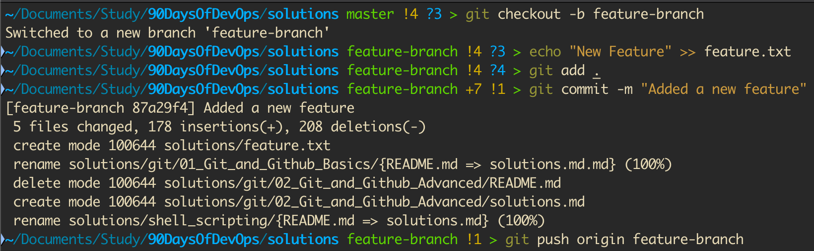
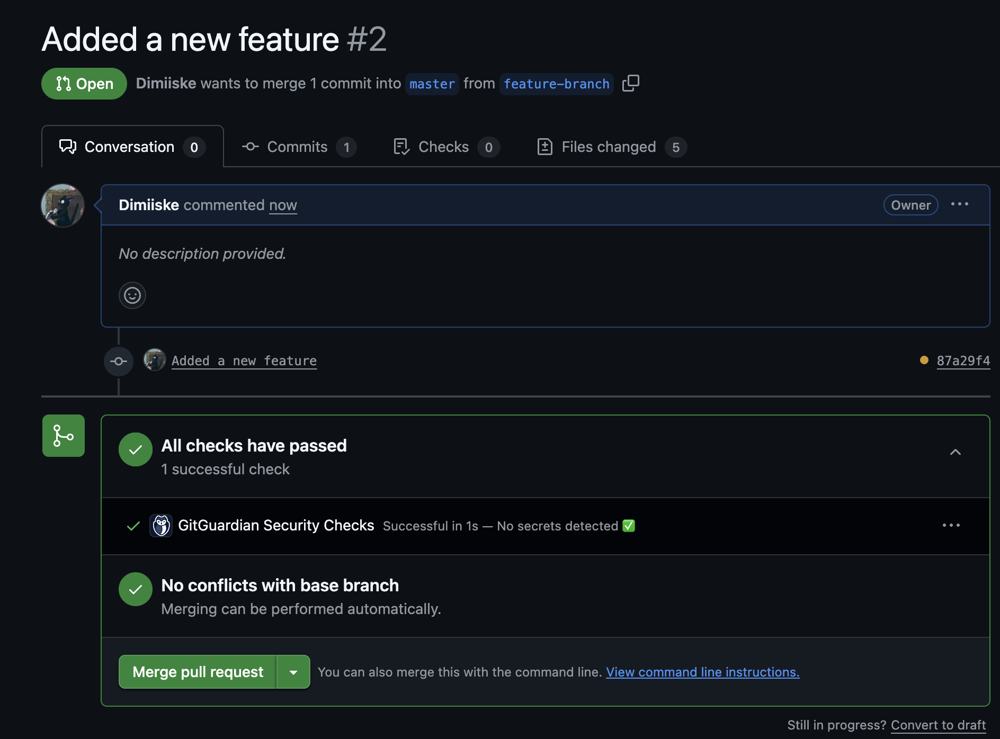
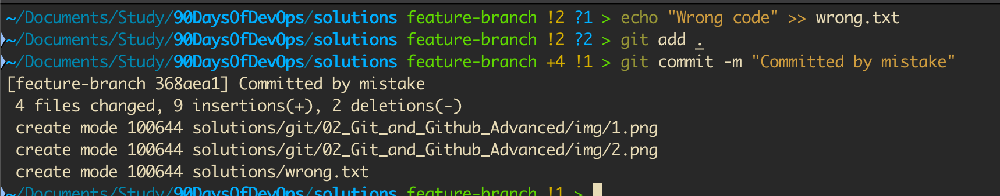
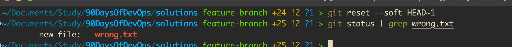
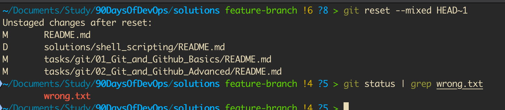
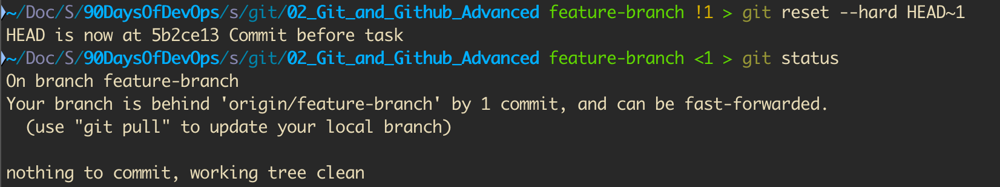
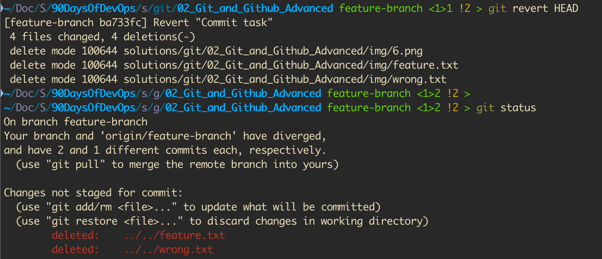
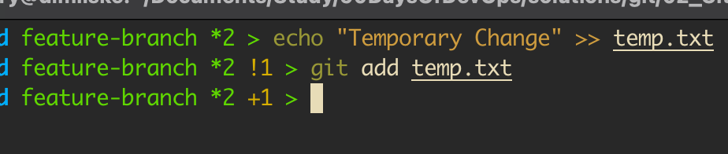
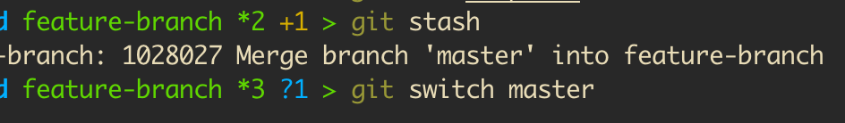
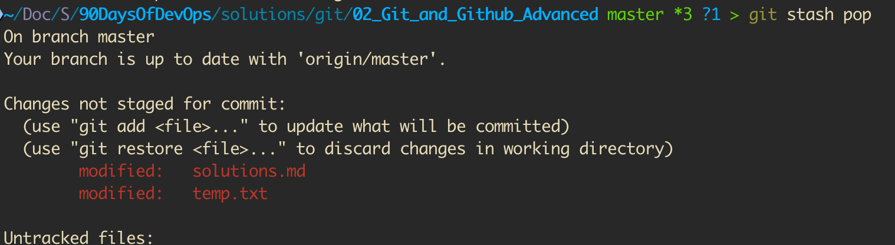

# Расширенное задание по Git и GitHub

Это задание охватывает продвинутые концепции Git, необходимые для реальных рабочих процессов DevOps. К концу задания вы сможете:  

- Понять, как эффективно работать с Pull Requests.
- Научиться отменять изменения с помощью Reset и Revert.
- Использовать Stashing для управления незафиксированной работой.
- Применять Cherry-picking для выборочных коммитов.
- Поддерживать чистую историю коммитов с помощью Rebasing.
- Изучить стандартные стратегии ветвления. 

## **Рассматриваемые темы**
1. Pull Requests – Сотрудничество в командах.
2. Reset и Revert – Безопасная отмена изменений.
3. Stashing – Временное сохранение работы.
4. Cherry-picking – Выбор конкретных коммитов.
5. Rebasing – Поддержание чистой истории.
6. Стратегии ветвления – Лучшие отраслевые практики.

## **Задачи**  

### **Задача 1: Работа с запросами на слияние (Pull Requests) (PRs)**  
**Scenario:** Вы работаете над новой функцией и вам необходимо объединить ваши изменения с основной веткой с помощью запроса на слияние (Pull Request).

1. Создайте форк репозитория и клонируйте его локально.
   ```bash
   git clone <your-forked-repo-url>
   cd <repo-name>
   ```
2. Создайте ветку разработки и внесите изменения.
   ```bash
   git checkout -b feature-branch
   echo "New Feature" >> feature.txt
   git add .
   git commit -m "Added a new feature"
   ```  
3. Отправьте изменения и создайте запрос на слияние (Pull Request).  
   ```bash
   git push origin feature-branch
   ```
   

4. Создайте запрос на слияние (PR) на GitHub, запросите проверку и объедините его после одобрения.

   

**Записать в `solution.md`**  
- Шаги по созданию запроса на слияние (PR).
- Рекомендации по написанию описаний запросов на слияние.
- Обработка комментариев к отзывам.

---

### **Задача 2: Отмена изменений – Сброс и возврат**  
**Сценарий:** Вы случайно внесли некорректные изменения, и вам необходимо их отменить.  

1. Создать и изменить файл.  
   ```bash
   echo "Wrong code" >> wrong.txt
   git add .
   git commit -m "Committed by mistake"
   ```

   

2. Мягкая перезагрузка (сохраняет изменения в исходном состоянии).  
   ```bash
   git reset --soft HEAD~1
   ```

   

3. Смешанный сброс (отменяет отметку об изменениях, но сохраняет файлы).  
   ```bash
   git reset --mixed HEAD~1
   ```  

   

4. Полная перезагрузка (удаляет все изменения).  
   ```bash
   git reset --hard HEAD~1
   ```

   

5. Безопасная отмена коммита.  
   ```bash
   git revert HEAD
   ```  

   

**Записать в `solution.md`**  
- Различия между `reset` и `revert`.  
- Когда использовать каждый метод.  

---

### **Задача 3: Сохранение данных — сохранение работы без подтверждения.**  
**Сценарий:** Вам нужно переключиться на другую ветку, но вы не хотите сохранить незавершенную работу.  

1. Изменить файл, не сохраняя изменения..  
   ```bash
   echo "Temporary Change" >> temp.txt
   git add temp.txt
   ```

   

2. Сохраните изменения.  
   ```bash
   git stash
   ```  

   

3. Переключитесь на другую ветку и используйте накопленные ресурсы..  
   ```bash
   git checkout main
   git stash pop
   ```  

   

**Записать в `solution.md`**  
- Когда использовать `git stash`.  
- Различия между `git stash pop` и `git stash apply`.  

---

### **Задача 4: Выборочное применение коммитов — избирательное применение коммитов.**  
**Сценарий:** Исправление ошибки существует в другой ветке, и вам нужно применить только этот конкретный коммит. 

1. Найдите коммит для выборочного удаления (cherry-picking).  
   ```bash
   git log --oneline
   ```  
   
   

2. Примените конкретный коммит к текущей ветке. 
   ```bash
   git cherry-pick <commit-hash>
   ```

   


3. Разрешите любые конфликты, если таковые имеются.  
   ```bash
   git cherry-pick --continue
   ```  

**Запишите в `solution.md`**  
- Как используется выборочный подход при исправлении ошибок.  
- Риски из-за cherry-picking.  

---

### **Задача 5: Rebasing — поддержание чистой истории коммитов.**  
**Сценарий:** Ваша ветка отстаёт от основной и нуждается в обновлении без дополнительных коммитов слияния.

1. Получить последние изменения. 
   ```bash
   git fetch origin main
   ```  
2. Rebase ветку разработки на основную ветку..  
   ```bash
   git rebase origin/main
   ```  
3. Разрешите конфликты и продолжайте.  
   ```bash
   git rebase --continue
   ```  

**Запишите в `solution.md`**  
- Разницу между `merge` и `rebase`.  
- Лучшие практики для rebasing.  

---

### **Задача 6: Стратегии ветвления, используемые в компаниях**  
**Сценарий:** Разберитесь в реальных стратегиях ветвления, используемых в рабочих процессах DevOps.  

1. Изучите и объясните рабочие процессы Git:
   - Git Flow (ветки Feature, Release, Hotfix).
   - GitHub Flow (ветки Main + Feature).
   - Разработка на основе основной ветки (непрерывная интеграция).

2. Имитация рабочего процесса Git с использованием ветвей.  
   ```bash
   git branch feature-1
   git branch hotfix-1
   git checkout feature-1
   ```  

**Запишите в `solution.md`**  
   - Какая стратегия лучше всего подходит для DevOps и CI/CD?
   - Преимущества и недостатки различных рабочих процессов.

---

## **Дополнительные ресурсы**  
- [Git Official Documentation](https://git-scm.com/doc)  
- [Git Reset & Revert Guide](https://www.atlassian.com/git/tutorials/resetting-checking-out-and-reverting)  
- [Git Stash Explained](https://git-scm.com/book/en/v2/Git-Tools-Stashing-and-Cleaning)  
- [Cherry-Picking Best Practices](https://www.atlassian.com/git/tutorials/cherry-pick)  
- [Branching Strategies for DevOps](https://www.atlassian.com/git/tutorials/comparing-workflows)  

